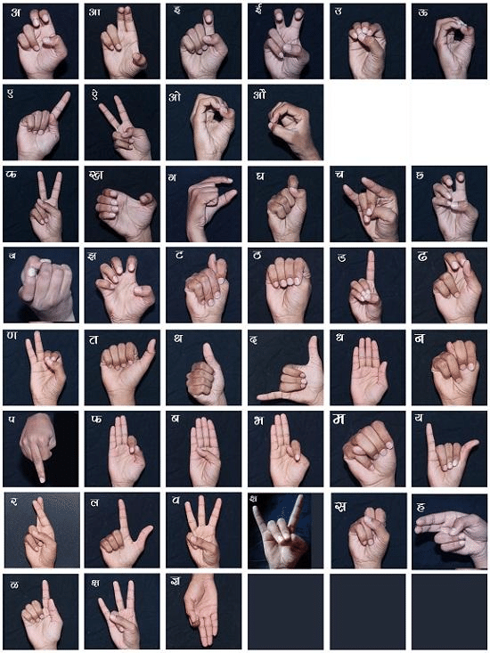
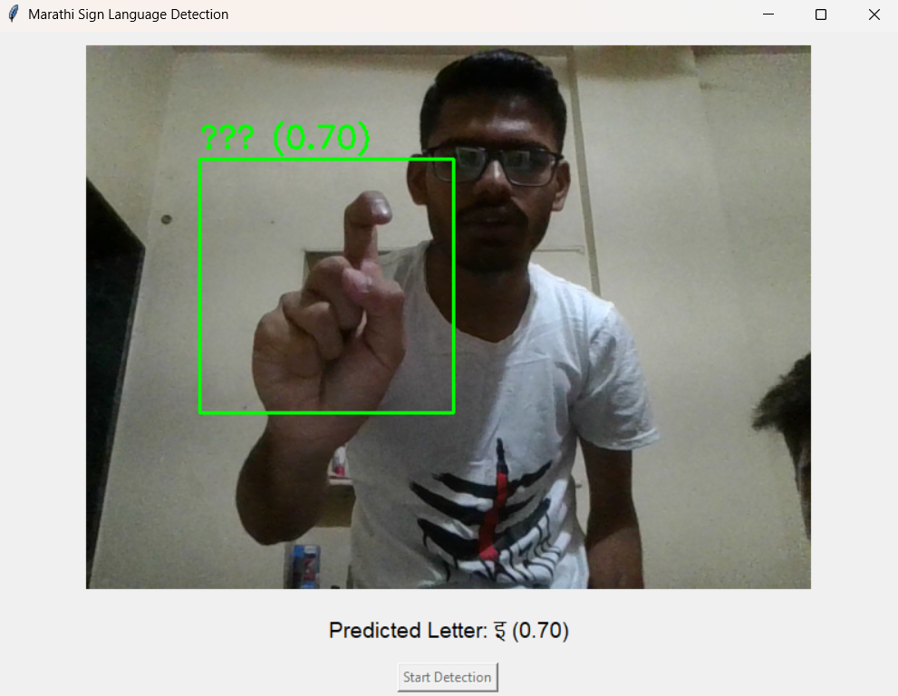
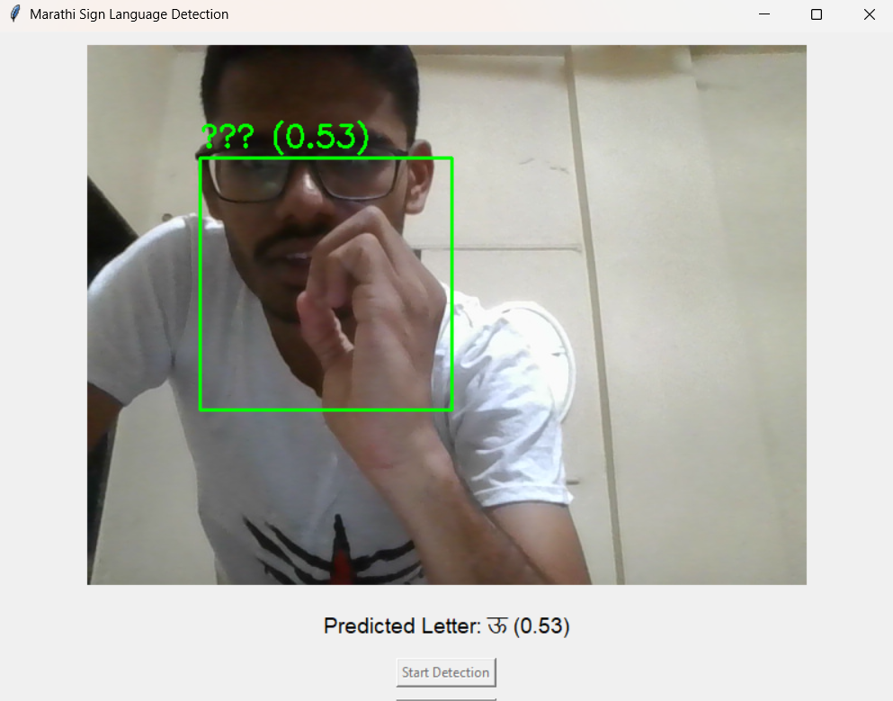
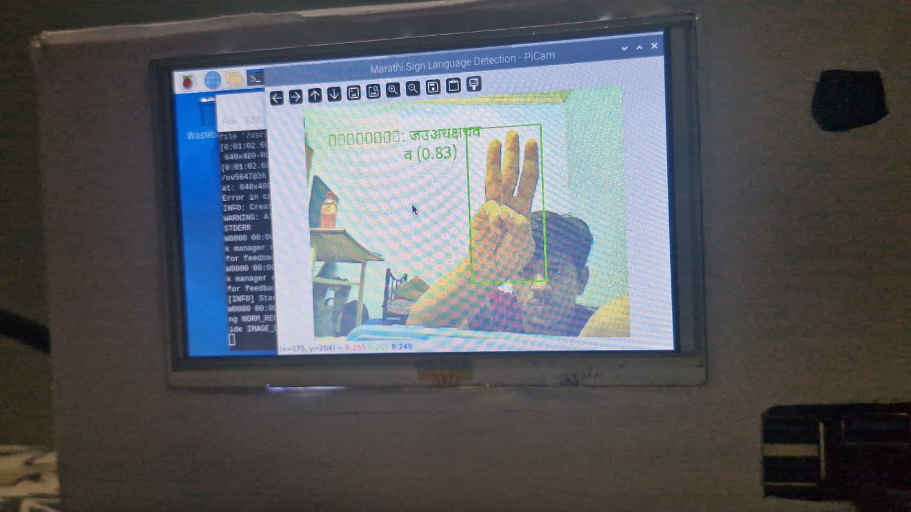
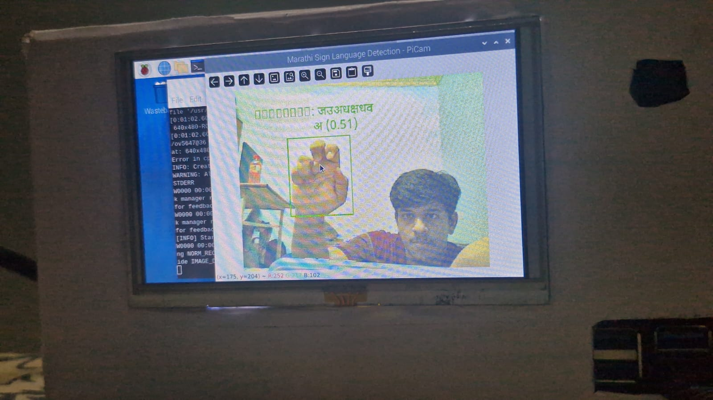

# Shabdancha Shunya: Marathi Sign Language Recognition System

**Shabdancha Shunya** is a real-time sign language recognition system tailored for the Marathi language. It leverages deep learning and computer vision to recognize hand gestures corresponding to Marathi characters. The system is trained using a custom dataset and deployed on a Raspberry Pi, making it affordable and portable.

## 🧠 Project Highlights

- **Language Focus**: Marathi Sign Language  
- **Model**: EfficientNetB0 (optimized with TensorFlow Lite)  
- **Dataset**: 43 gestures (Marathi letters), 1000 images per gesture  
- **Technologies**: TensorFlow, OpenCV, Python, TFLite  
- **Hardware**: Raspberry Pi with a 5-inch HDMI display and camera module  
- **Real-Time**: Predicts and displays gesture output live on Raspberry Pi

## 📁 Dataset

- 43 Marathi letters
- 1,000 images per letter (captured using OpenCV)
- Custom-created for this project
- Image preprocessing includes resizing, normalization, and background removal

### Sample Dataset Image 📸
<div align="center">
  
</div>

### Dataset on Hugging Face

You can access the dataset for this project on Hugging Face:

[Download the Marathi Sign Language Dataset from Hugging Face](https://huggingface.co/datasets/HarshadDeshmukh/Marathi-Sign-Language-Dataset)


## 🚀 Workflow

1. **Data Collection**  
   Captured gesture images using OpenCV in real-time.

2. **Preprocessing**  
   Converted images to grayscale, applied filters, resized to model input dimensions.

3. **Model Training**  
   Trained EfficientNetB0 on PC using TensorFlow.

4. **Model Conversion**  
   Converted trained model to TensorFlow Lite (.tflite) format.

5. **Deployment**  
   Deployed TFLite model to Raspberry Pi with custom Python script for real-time recognition.

6. **Output Display**  
   Recognized sign is displayed as corresponding Marathi letter on the screen.

## 🖥️ System Architecture

[Gesture Input] → [Camera Module] → [Preprocessing] → [TFLite Model Inference] → [Marathi Letter Output]


## 🛠️ Requirements

To run this project, install the following Python packages:

```bash
opencv-python>=4.5.5  
numpy>=1.21.0  
tensorflow>=2.10.0  
Pillow>=9.0.0  
picamera2>=0.3.0  
tflite-runtime>=2.10.0  
cvzone>=1.5.0


```
## 🎯 Final Outcome

The results of this project can be divided into two stages:

### 🖥️ Stage 1: On PC (Training and Testing)

- The model is trained using the custom Marathi sign dataset on a PC using TensorFlow and EfficientNetB0.
- After training, predictions are tested on the PC using test gesture images.
- Outputs are verified for accuracy, and confusion matrix/performance metrics are generated.

### 🍓 Stage 2: On Raspberry Pi (Real-Time Inference)

- The trained model is converted into TensorFlow Lite (.tflite) format for optimized performance.
- The `.tflite` model is deployed on Raspberry Pi.
- Live camera input captures hand gestures.
- Recognized Marathi letter is displayed in real-time on the 5-inch HDMI display connected to the Pi.

📸 Example:
## 🖥️ Output on PC

<div align="center">
  
  
</div>


## 🍓 Output on Raspberry Pi
<div align="center">
  
  
</div>


## 🌐 Future Scope

- Add text-to-speech for voice output in Marathi.
- Expand to support full sentence gestures and dynamic signs.
- Port to Android/iOS for mobile accessibility.
- Integrate into classrooms or government services.

## 📜 License  
This project is licensed under the MIT License. See the [LICENSE](LICENSE) file for details.

## 🙏 Acknowledgments  
Special thanks to the contributors and the open-source community for their invaluable support and resources.

  
#### Feel free to explore, contribute, and make **Shabdancha Shunya** even better!

Together, let's create a world where communication has no barriers. 🤝💬🌟


